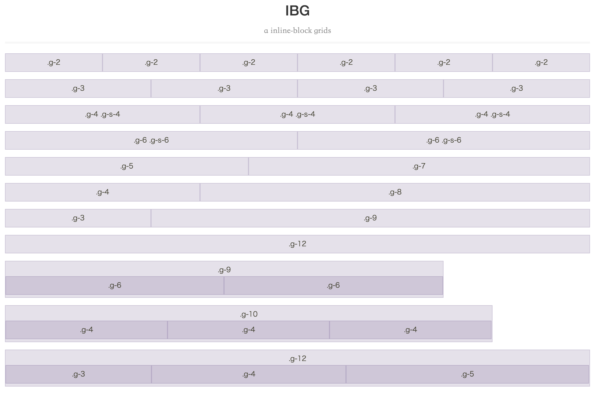

## IBG

**a inline-block grids**

[DEMO](http://lvwzhen.github.io/IBG/)



### Usage

**HTML**

```html
<div class="container">
	<div class="row">
    	<div class="g-1">grid-1</div>
        ...
        <div class="g-1">grid-1</div>    
    </div>
</div>
```

**CSS**

```css
.container {
    padding-left: 15px;
    padding-right: 15px;
    margin-right: auto;
    margin-left: auto;
}   
.row {
    font-size:0;/* 所有浏览器 */
    *word-spacing:-1px;/* IE6、7 */
    margin-right: -15px;
    margin-left: -15px;
}
[class*="g-"]{
    vertical-align:top;
    word-spacing: normal;
    letter-spacing: normal;
    font-size: 14px;
    padding-left: 15px;
    padding-right: 15px;
}
@media screen and (-webkit-min-device-pixel-ratio:0){
/* firefox 中 letter-spacing 会导致脱离普通流的元素水平位移 */
     .row{
            letter-spacing:-5px;/* Safari 等不支持字体大小为 0 的浏览器, N 根据父级字体调节*/
    }
}

//Responsive

@media (min-width: 768px){
    .container {
    width: 750px;
    }
}
@media (min-width: 992px){
    .container {
    width: 970px;
    }
}
@media (min-width: 1200px){
    .container {
    width: 1170px;
    }
}
.g-s-12 {
     width: 100%
}
...
.g-s-2 {
    width: 16.666666666666664%
}

.g-s-1 {
    width: 8.333333333333332%
}

@media(min-width: 992px){

    [class^="g-"] {
    display: inline-block;
    *display:inline;
    *zoom:1;
    }

    .g-12 {
         width: 100%
    }

    .g-11 {
        width: 91.66666666666666%
    }

    .g-10 {
        width: 83.33333333333334%
    }
    ...
    
    .g-1 {
        width: 8.333333333333332%
    } 
}
```

**Non-responsive**

1. remove viewport `<meta>` 

`<meta name="viewport" content="width=device-width, initial-scale=1.0">`

2. set width for container 

`.container { width: 970px !important; }`

3. use `.g-s-*` classe

```html
<div class="row">
    <div class="g-s-3">.g-s-3</div>
    <div class="g-s-9">.g-s-9</div>
</div>
```

[DEMO](http://lvwzhen.github.io/IBG/non-responsive.html)


## MIT license

The MIT License (MIT)

Copyright (c) 2014 lvwzhen

Permission is hereby granted, free of charge, to any person obtaining a copy
of this software and associated documentation files (the "Software"), to deal
in the Software without restriction, including without limitation the rights
to use, copy, modify, merge, publish, distribute, sublicense, and/or sell
copies of the Software, and to permit persons to whom the Software is
furnished to do so, subject to the following conditions:

The above copyright notice and this permission notice shall be included in all
copies or substantial portions of the Software.

THE SOFTWARE IS PROVIDED "AS IS", WITHOUT WARRANTY OF ANY KIND, EXPRESS OR
IMPLIED, INCLUDING BUT NOT LIMITED TO THE WARRANTIES OF MERCHANTABILITY,
FITNESS FOR A PARTICULAR PURPOSE AND NONINFRINGEMENT. IN NO EVENT SHALL THE
AUTHORS OR COPYRIGHT HOLDERS BE LIABLE FOR ANY CLAIM, DAMAGES OR OTHER
LIABILITY, WHETHER IN AN ACTION OF CONTRACT, TORT OR OTHERWISE, ARISING FROM,
OUT OF OR IN CONNECTION WITH THE SOFTWARE OR THE USE OR OTHER DEALINGS IN THE
SOFTWARE.
